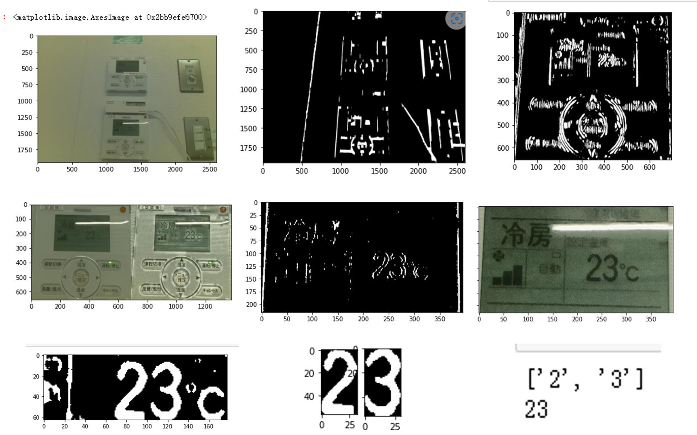

# ImageRecognition_OpenCV
Recognizing set-point temperature via Raspberry Pi based on OpenCV 

## Process Flow
The image recognition process follows these steps:

  

1. Start
2. Take the image when people change temperature
3. Input image
4. Image contrast enhancement
5. Apply three techniques in parallel:
   - Threshold
   - Grayscale
   - Erode
6. Contour extraction
7. Contour only set-point temperature
8. Judgment with sample numbers
9. Output

## Example Images

  

## Reference
For more detailed information on PMV calculation and thermal comfort, please refer to the following paper:
- __Yutong CHEN__,
[Development of Low-Cost IoT Units for Thermal Comfort Measurement and AC Energy Consumption Prediction System](https://kth-my.sharepoint.com/personal/torunw_ug_kth_se/_layouts/15/onedrive.aspx?ga=1&id=%2Fpersonal%2Ftorunw%5Fug%5Fkth%5Fse%2FDocuments%2Fbox%5Ffiles%2FRoomVent%2FRoomVent%5F2024%5FProceedings%2F240425%201400a%20Session%2026%20IC%20Thermal%20comfort%201%2FPrint%20439%20Final%2Epdf&parent=%2Fpersonal%2Ftorunw%5Fug%5Fkth%5Fse%2FDocuments%2Fbox%5Ffiles%2FRoomVent%2FRoomVent%5F2024%5FProceedings%2F240425%201400a%20Session%2026%20IC%20Thermal%20comfort%201
), presented at RoomVent2024.

## License
This project is licensed under the MIT License - see the [LICENSE](LICENSE) file for details.
